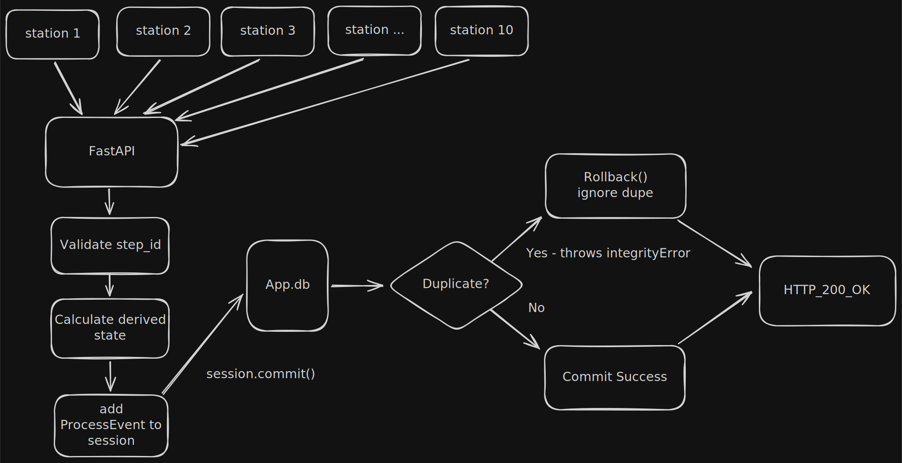

# Peak Energy MES Backend Take-Home

## Overview

This project is a data-driven MES manufacturing line backend system.

Simulated manufacturing stations send data entries to the backend to store in a local database. Handles retries, duplicates, and out-of-order entry arrival.

This implementation is particularly focused on handling:
- duplicate events under concurrency
- preserving accepted events across system restarts
- maintaining event progression tracking even when events arrive out-of-order

## Problem Context

We have an existing ESS manufacturing line, which under normal conditions works fine. 

Design a backend system that works under abnormal conditions as follows:

- Events from 10 stations arrive concurrently and out of order
- The network between stations and the backend is unreliable — events may be delayed, duplicated, or lost
- Stations buffer locally and retry on failure, but provide no exactly-once delivery guarantee
- The backend must never write a duplicate record for the same process step on the same unit
- A station may restart mid-production and re-publish events for any step it believes was not acknowledged
- The backend must remain eventually consistent across crashes and restarts
- Two stations may attempt to update the same unit record simultaneously

## Design Summary

### Core data model

`ProcessEvent` (`models.py`) establishes `(unit_id, step_id)` must be unique.

Key columns:

- `event_id`: original station event identifier
- `unit_id`: production unit identifier
- `station_id`: station source
- `step_id`: process step
- `occurred_at`: station event timestamp
- `step_index`: normalized index of configured step sequence
- `unit_state`: computed state snapshot at ingestion time

### Idempotency strategy

Event table enforces a uniqueness constraint:

- `UNIQUE(unit_id, step_id)`

The API performs a database lookup on incoming requests to ensure duplicate entries are handled and manages race conditions by catching `IntegrityError` on database commit.

This approach prevents identical events from clogging up the database and deals with concurrent collision conflicts.

### Event ordering strategy

Events are accepted even if out of order.

The backend computes state using the set of already-known steps for a unit plus the incoming step:

- if all steps present -> `COMPLETE`
- if no contiguous step from the beginning -> `AT_START`
- otherwise -> `AT_<latest_contiguous_step>`

This supports delayed delivery and buffered replay without rejecting valid late events.

### Durability and restart behavior

- SQLite file (`app.db`) provides durable local storage.
- On startup, schema creation runs via SQLModel metadata.

## Architecture Diagram



## API

### `POST /api/events`

Request body:

```json
{
	"event_id": "4c4f2fbe-8f08-4cbe-9e8a-2e51452ad3f0",
	"unit_id": "UNIT-0001",
	"station_id": "station-01",
	"step_id": "STEP-ALPHA",
	"occurred_at": "2026-04-13T12:00:00Z"
}
```

Responses:

- `200 {"status": "saved"}` when a new logical unit-step is persisted
- `200 {"status": "duplicate_ignored"}` when replay/duplicate is detected
- `400 {"status": "invalid_step", "known_steps": [...]}` for unknown step IDs

## Local Setup

1. Create and activate a virtual environment.
2. Install dependencies.
3. Run the API server.

Example:

```bash
python -m venv .venv
source .venv/bin/activate
pip install fastapi uvicorn sqlmodel sqlalchemy httpx pytest pytest-asyncio
uvicorn main:app --reload
```

The service runs at `http://127.0.0.1:8000`.

## Running the Simulation

The simulator fires concurrent events from 10 stations for one unit/step and verifies idempotency:

```bash
python simulate_stations.py
```

Expected outcome:

- one event reported as `saved`
- remaining duplicates reported as `duplicate_ignored`
- DB row count for that unit/step equals `1`

## Tests

Run tests:

```bash
pytest -v
```

Covered scenarios (`test_simulate_stations.py`):

- sequential happy path across all three steps
- concurrent duplicate events for same unit step
- out-of-order delivery
- delayed replay from local station buffer
- concurrent different steps for the same unit

## Reflections & Conclusions

### Hardest Problems

For me, the most challenging part of this project was visualizing my system in its operational environment and considering where things go wrong.

In designing this, I took a very step-by-step approach, meaning I tackled problems one by one as they came up and tried to break up the problem. At first, my main focus and challenge was implementing uniqueness. My first design involved a system where I would have some existing database that I would check before every insert to make sure there were no duplicates.

I learned that this implementation failed under concurrent load. Duplicates could bypass the check if all are added at the exact same time. The first problem I struggled with was finding a way to maintain unique entries in a way that supports concurrent payloads. After further documentation deep dives, I learned it was possible to deal with uniqueness at the database level and by using `IntegrityError` (more on this in the key architectural choices section).

Another hard problem was event tracking and out-of-order entries. At first, I approached event tracking naively. My implementation ensured event order by requiring the previous event to already exist in the database for a new step to be registered. I later considered that in the operational environment there would be times where stations' communication to the server is buffered, leading to out-of-order events, which is another constraint I failed to consider in my first design.

### Key Architectural Choices & Trade-offs 

1. Database-enforced idempotency (uniqueness) (`UNIQUE(unit_id, step_id)`)
   - Benefit: deals with concurrent duplication
   - Trade-off: Database cannot be updated and is write only

2. Accepting out-of-order events (no strict sequencing requirement)
   - Benefit: tolerant of network delays and station buffering/replay, which reduces operational brittleness.
   - Trade-off: Implementation is harder to write and maintain. Developers have to account for additional behaviors, such as what to do when a future event is waiting for a prior event, or what if it doesn't show up.

3. Some columns contain data "snapshots" (`unit_state`, `step_index`)
   - Benefit: each row is self-describing and easier to audit/debug.
   - Trade-off: stored state is a snapshot in time, so if state rules change later (for example, step-sequence changes), historical interpretation may require backfill.

4. SQLite database
   - Benefit: fast local setup, durable storage, and easy inspection.
   - Trade-off: not representative of production environments with multiple instances, heavier concurrency, migrations, backups, and operational tooling.


### Out-of-Scope & Future Improvements

This project intentionally focuses on the ingestion core (idempotency and ordering tolerance) and leaves production hardening out of scope.

Out-of-scope areas in the current implementation:

- User logins, security, and permissions.
- Tools for automatically updating the database structure.
- Error tracking and performance dashboards.
- Setup for running the app across multiple servers.

If extending this system beyond the take-home, the highest-value improvements would be:

1. Move to PostgreSQL - for better concurrency load and traffic
2. Add Database Migrations - find a way to add or change tables without losing data
3. Better logging and tracking - need a simpler way to track stuck requests and troubleshoot
4. Dashboard - better item access at a glance


## Project Files

- `main.py`: FastAPI app and ingestion logic
- `models.py`: SQLModel table and request schema
- `simulate_stations.py`: standard concurrency test
- `test_simulate_stations.py`: async test scenarios
- `app.db`: local SQLite database file
- `doc-assets`: diagrams/models used to render in `README.md`